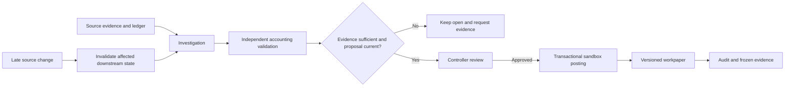

# Meridian — Autonomous Month-End Close

**AI investigates. Code verifies. Controller decides.**

Meridian investigates intercompany accounting differences, prepares evidence-backed corrections for a controller, and carries changes through to versioned workpapers and an audit trail. When evidence is missing, contradictory, or stale, it stops the affected work instead of presenting an unsupported clean close.

Built for **Syndicate by Maximor · Track 2: Autonomous Office of the CFO**.

[](https://github.com/bhavyakeerthi3/meridian-close/actions)

[Run locally](#clone-and-run) · [Product walkthrough](#explore-the-product) · [Control proof](#what-we-test) · [AO engineering record](#how-we-used-agent-orchestrator) · [Three-minute video script](docs/VIDEO-SCRIPT.md)

## The problem we solve

A month-end close is not finished when the spreadsheet balances. Someone must establish which source is authoritative, explain missing or duplicate entries, apply policy, review a correction, and update the accounting package when evidence arrives late.

Meridian connects that work across three synthetic subsidiaries: US, UK, and India. Transaction amounts are in USD; each entity books in its functional currency using explicit synthetic policy rates. The workflow handles missing payables, duplicate balances, incorrect booking rates, unreflected credits, and disputed services.

**Meridian automates the investigation and verification around the controller’s judgment.** It gives the controller a reviewable finding and makes the reason for stopping visible.

## Clone and run

The repository is **public**. No access code, GitHub token, or API key is required for deterministic rehearsal.

Requires Git and **Node.js 22.13+**. Tested with Node 22.20.0 on Windows.

```sh
git clone https://github.com/bhavyakeerthi3/meridian-close.git
cd meridian-close
npm ci
npm run demo
```

Open **http://127.0.0.1:4320/**. Keep the terminal running; press Ctrl+C to stop.

- No `.env.local` is needed for the default rehearsal.
- SQLite creates your workspace in `data/`; restarting preserves evidence and journals.
- A fresh clone includes **six synthetic invoice cases**. The recorded seven-case demo includes an additional Judge Lab invoice. The private local database is not committed.
- This is a local application. A GitHub repository URL is not a hosted demo URL.

See [the complete setup guide](docs/GETTING-STARTED.md) for first-run steps, live keys, ports, and troubleshooting.

## Follow a complete close



1. **Read the evidence.** The investigator uses scoped tools to inspect documents, booked balances, and policy.
2. **Explain the difference.** It produces an evidence-linked finding. The model has no posting or approval tool.
3. **Verify independently.** Code recomputes obligations and checks accounts, currencies, entities, source references, arithmetic, and resulting balances. Balanced entries alone are insufficient.
4. **Ask the controller.** A current proposal and simulated group-controller approval are required before posting.
5. **Commit and retain proof.** Journal, approval, and audit event commit together. A posting retry returns the existing journal.
6. **Recover from change.** Late credits or source revisions make affected conclusions and reports stale. Historical journals remain; compensating corrections need fresh review.

### One case that resolves

IC-1042 starts with USD 12,000 booked by the seller and no buyer payable. Under the configured synthetic GBP rate of 0.8, the expected buyer balance is GBP 9,600. Meridian prepares expense/payable lines, validates them, and waits for controller approval.

### One case that must remain open

IC-1047 has disputed service acceptance. Signed confirmation is missing. Meridian exposes the blocker and the policy boundary; it does not turn uncertainty into an approved correction. A workpaper containing unresolved cases remains provisional and excludes them from eliminations.

### A recorded live challenge

A browser-entered invoice, **JUDGE-LIVE-731**, began at USD 12,743.17. A competing source required a controller source decision. A later USD 250.37 credit changed the net obligation to USD 12,492.80 and GBP 9,994.24. A worker was terminated after a checkpoint and unfinished work resumed. The records preserve prior journals, compensation, and a duplicate-safe approval retry.

This is a recorded synthetic demonstration, not a general model-accuracy or production reliability claim. [Challenge record](docs/DEMO.md) · [Frozen revised workpaper](evidence/judge-revised-workpaper.json)

## Explore the product

| Screen | Question it answers | What is implemented |
| --- | --- | --- |
| **Close Overview** | What is happening, and what needs the controller? | Current reconciliation, controlled exceptions, workpaper freshness, priority blocker, close pipeline, recent activity, and a short walkthrough. |
| **Control Tower** | What needs attention next? | Evidence/reconciliation/approval/workpaper readiness, posting queue, controller priorities, and latest evidence-change impact. |
| **Investigations** | Why is the close different? | Filterable case list, selected case, deterministic display priority, source/ledger comparison, policy evaluation, proposed entries, independent checks, and dependency view. |
| **Evidence Room** | What proves the finding? | Source documents, invoice relationships, revisions, conflicts, imported email/meeting text, and downstream impact. |
| **Workpapers** | What accounting package results? | Versioned reconciliation and USD elimination workpapers, frozen evidence and ledger snapshots, provisional exceptions, freshness warnings, and JSON export. |
| **Judge Lab** | Does the workflow hold under failure? | New invoices and opening balances, competing sources, controller source selection, late credits, real process interruption, checkpoint resume, and trace verification. |
| **Accountant Review** | Does assistance help a human reviewer? | Randomized manual/assisted tasks, server timing, answer accuracy, feedback, consent, and rehearsal exclusion. No completed accountant productivity study is claimed. |
| **Run History** | What did the system actually do? | Run outcomes, event replay and details, checkpoints, interrupted/resumed work, guardrail evidence, and failure-context export. |
| **Cash Evidence** | Is optional provider evidence available? | Read-only Dodo test-mode import with bounded pagination, deduplication, and row balance checks. Not required for the close. |
| **Connections** | What powers and verifies Meridian? | Runtime/provider status, trace evidence, architecture, AO session provenance, decision ledger, and release records. |

Priority scores are deterministic UI aids, not calibrated financial-risk predictions. Evidence-request text is a draft; importing conversations does not connect or send messages through Gmail, Slack, or a meeting service.

## What is autonomous, and what is controlled?

| Meridian can perform | Controller or explicit user action remains required |
| --- | --- |
| Investigate available evidence and reconcile records | Establish authority when sources conflict |
| Apply configured accounting policy and independently validate proposals | Confirm missing service acceptance |
| Detect stale dependencies and preserve historical records | Approve a current correction before posting |
| Persist checkpoints and resume unfinished work when requested | Start challenges, import evidence, and initiate recovery |
| Prepare versioned workpapers when requested | Review provisional exceptions and refreshed workpapers |

The system cannot approve its own judgment, bypass validation, erase a dispute, or change accounting policy based on an instruction embedded in source evidence.

## What we test

The current release passes **103 automated tests**. GitHub Actions runs the suite, type/syntax checks, deterministic evaluation, and local trace diagnostic on pushes and pull requests.

```sh
npm test
npm run check
npm run evaluate
npm run check:traces
```

| Control | Representative checks |
| --- | --- |
| Evidence integrity | Unknown references, source-version deduplication, conflicting invoices, fabricated source rejection. |
| Deterministic accounting | Integer money, rounding, wrong accounts/entities/currencies, and balanced-but-wrong proposals. |
| Approval protection | Blocked cases, stale revisions, wrong simulated roles, and imported instructions cannot authorize posting. |
| Duplicate safety | Approval replay, concurrent approvals, and process kills before/after commit. |
| Failure recovery | Actual worker termination, checkpoint retention, restart, and unfinished-bundle resume. |
| Freshness | In-flight source changes, late credits, invalidated downstream state, and frozen historical exports. |
| Audit and API boundaries | Atomic journal/approval/events, persistence after reopen, malformed input, and cross-origin write rejection. |

The separate held-out arithmetic/validator evaluation passed **30/30 cases**. AI SDK contract tests use mock model transport. These results do not establish a live-model success rate, measured human time savings, or production certification.

[Coverage matrix](evidence/TEST-COVERAGE-MATRIX.md) · [Control invariants](evidence/CONTROL-INVARIANTS.md) · [Judge evaluations](evidence/JUDGE-EVALUATIONS.md) · [Adversarial validation](evidence/ADVERSARIAL-VALIDATION.md)

## Runtime architecture

- **Client:** browser JavaScript and CSS; shared controller workspace and progressive disclosure.
- **API:** local Node HTTP server with input and write-origin checks.
- **Investigator:** AI SDK ToolLoopAgent with a TensorMux-compatible model endpoint, plus explicitly labeled deterministic rehearsal.
- **Accounting:** independent proposal and validation modules using integer minor units and explicit policies.
- **Execution:** an isolated child process with persisted invoice checkpoints.
- **Persistence:** SQLite, WAL, FULL synchronous durability, and transactional approval/posting.
- **Observability:** optional Neatlogs workflow, model, tool, and guardrail spans; selected traces verified by authenticated read-back.

```text
public/          Product UI and Judge Lab interactions
src/agent.js     Tool-using investigator and provider setup
src/accounting.js  Source obligations and correction proposals
src/validator.js   Independent accounting checks
src/workflow.js    Approval, posting, invalidation, reports, and recovery
src/runner.js      Worker lifecycle and interruption
src/store.js       SQLite persistence and transactions
src/cases.js       New cases and controller source decisions
src/study.js       Manual/assisted review protocol
src/dodo.js        Optional read-only cash evidence
src/fixture.js     Synthetic starting cases
scripts/          Demo launcher, evaluation, and live verification
 tests/           Automated control and API tests
 evidence/        Recorded checks, sponsor receipts, and AO provenance
 docs/            Setup, demo, sponsor notes, and submission material
```

## How we used Agent Orchestrator

**AO coordinates engineering. Meridian coordinates finance execution.**

| Recorded session | Contribution |
| --- | --- |
| `closeloop-1` | Initial design review and five acceptance themes: independent validation, credit/duplicate safety, stale approvals, crash recovery, and fail-closed approval. No files changed in that review. |
| `closeloop-2` | Final-hardening orchestration, scoped assignments, and evidence routing. |
| `closeloop-4`, `closeloop-5`, `closeloop-6` | Controls, UX, and recovery work in isolated worktrees, with scoped evidence and verification records. |
| `closeloop-7`, `closeloop-8` | Independent review: one approval after evidence corrections; a wording-request limitation was retained. |
| `closeloop-9` through `closeloop-12` | Read-only control, recovery, provenance, and claim audits. |

AO evidence does not mean AO authored all historical implementation, ran finance investigations, or completed a hosted PR review. Historical 36- and 39-test artifacts are retained separately from the later 103-test suite. The package/session name remains `closeloop`; the submitted product is Meridian.

[Design review](evidence/AO-DESIGN-REVIEW.md) · [Final hardening record](evidence/AO-FINAL-HARDENING.md) · [Evidence map](evidence/AO-EVIDENCE-MAP.md) · [Decision ledger](evidence/AO-DECISION-LEDGER.md) · [Red-team findings](evidence/AO-RED-TEAM-2026-09-06.md)

## Sponsors and optional live execution

| System | Actual role and boundary |
| --- | --- |
| **Agent Orchestrator** | Engineering coordination and review evidence; not the finance runtime. |
| **TensorMux** | Live tool-using investigator. Recorded GLM-4.7-Flash calls exercised source, ledger, policy, checker, and finding tools. No posting authority. |
| **Neatlogs** | Optional observability. Selected real traces were read back from its authenticated API; universal trace delivery is not claimed. |
| **Dodo Payments** | Optional read-only test-mode cash connector. Account access is not claimed verified; mock transport is tested. |
| **AI Grants India** | Optional configuration exists; not used by the current close workflow. |
| **Maximor** | CFO domain and hackathon context; informational reference, not a runtime integration. |

For live execution, create `.env.local` from `.env.example`, add your own TensorMux key and optionally a Neatlogs key, then restart. Keep keys local. Failed live calls remain failures; they do not silently substitute rehearsal.

```sh
# Optional: consumes provider credits and exports synthetic telemetry when configured.
npm run verify:live
npm run verify:failure
```

[Live sponsor receipt](evidence/live-sponsor-verification.json) · [Guardrail failure receipt](evidence/live-guardrail-failure.json) · [Sponsor details](docs/SPONSORS.md)

## Scope and known limits

Meridian is a local synthetic intercompany-services sandbox. It is not statutory consolidation, production ERP, or a public multi-user accounting deployment. Reviewer roles are simulated; real authentication and segregation of duties are not implemented. Email and meeting excerpts are manually imported. Currency rates are synthetic policy values, not market quotations.

Recovery claims are bounded to the tested process and transaction paths. Multi-process run-start locking and a run-wide atomic evidence snapshot are not claimed. Optional provider availability varies. The recorded dependency audit reports 12 moderate advisories; see [dependency observations](docs/SPONSOR-BUG-DRAFTS.md).

No completed accountant productivity study or ROI measurement is claimed. The review protocol is implemented so that actual feedback can be collected and labeled accurately.

## Judge and contributor reading path

1. [Clone and complete the first investigation](docs/GETTING-STARTED.md).
2. [Record or follow the three-minute demo](docs/VIDEO-SCRIPT.md), including exact fresh-invoice fields.
3. Inspect IC-1047, run a Judge Lab challenge, and follow recovery and workpaper consequences.
4. Read [architectural decisions](DECISIONS.md), [the build log](evidence/BUILD-LOG.md), and [engineering report](evidence/FINAL-ENGINEERING-REPORT.md).
5. Verify the source and tests directly. For a change, preserve accounting invariants and run the checks above before opening a pull request.

The public repository is available now. Video publication and final hackathon submission are separate steps. The core product thesis remains: **Meridian knows when to act, when to ask for evidence, and when it must stop.**
